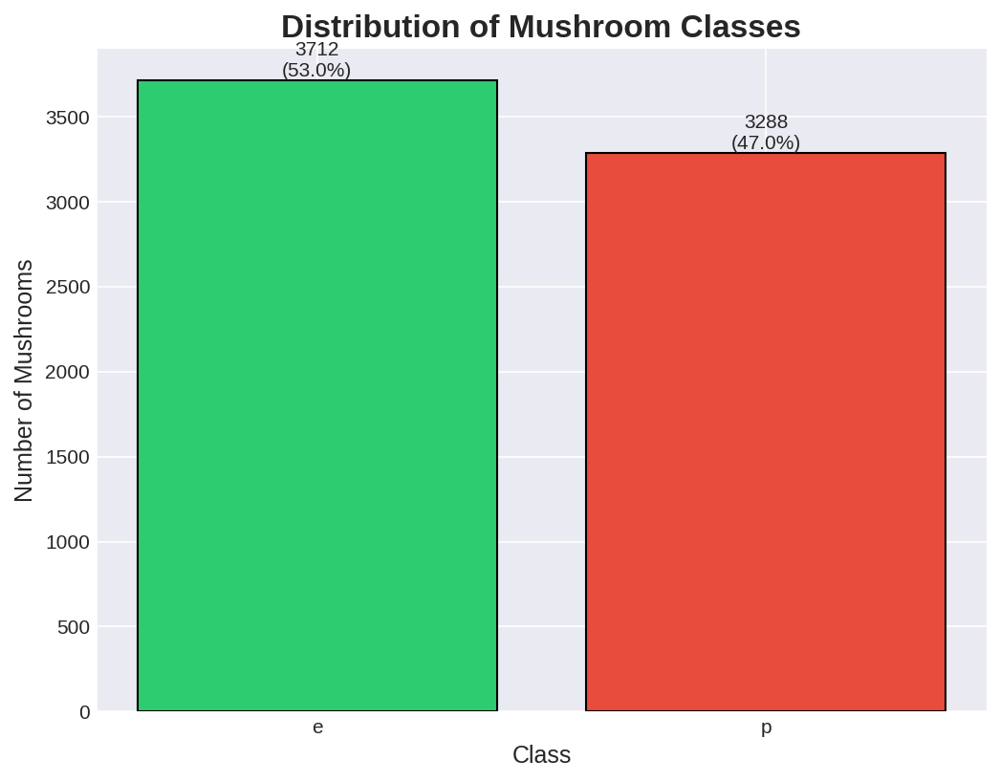

#  Mushroom Edibility Classifier — Kaggle Competition


> **Predicting whether a mushroom is edible or poisonous using ensemble machine learning models.**
> Submitted as part of the IIT Madras BS Degree — Machine Learning Practice (MLP) Coursework, Jan 2026.

---

##  Project Overview

This project tackles a real-world binary classification problem: **given 20+ physical characteristics of a mushroom, predict whether it is safe to eat or potentially deadly.** The dataset is derived from the classic UCI Mushroom Dataset, adapted for a Kaggle competition.

The project demonstrates a complete, production-style machine learning workflow — from raw data loading to competition submission.

---

##  Problem Statement

Mushroom foraging is dangerous without expert knowledge. Certain toxic species closely resemble edible ones, making visual identification unreliable. This project builds a machine learning classifier to automate edibility prediction using observable physical traits such as odor, gill color, cap shape, and spore print color.

**Task:** Binary Classification — Edible (`e`) vs. Poisonous (`p`)
**Evaluation Metric:** Accuracy

---

##  Dataset Information

| Property | Value |
|---|---|
| Source | Kaggle Competition — MLP Jan 2026 |
| Training samples | ~6,500 rows |
| Test samples | ~1,600+ rows |
| Features | 20+ categorical columns |
| Target | `class` — edible (`e`) / poisonous (`p`) |
| Missing values | Present in several columns |
| Feature types | All categorical (text-based) |

**Key features include:** cap-shape, cap-color, odor, gill-color, gill-size, stalk-shape, ring-type, spore-print-color, habitat, and more.

>  Dataset is not included in this repository per Kaggle competition rules.
> Download from: [Kaggle Competition Page](https://www.kaggle.com)

---

##  Technologies Used

| Tool | Purpose |
|---|---|
| Python 3.10 | Core language |
| Pandas | Data manipulation |
| NumPy | Numerical operations |
| Matplotlib & Seaborn | Visualization |
| Scikit-learn | ML models, preprocessing, evaluation |
| XGBoost | Gradient boosting classifier |
| GridSearchCV | Hyperparameter tuning |
| Jupyter Notebook | Interactive development |

---

## Machine Learning Workflow

```
Raw Data
   │
   ▼
Step 1: Load & Explore Data
   │
   ▼
Step 2: Identify Column Types (Categorical vs Numerical)
   │
   ▼
Step 3: Handle Missing Values (Mode for categorical, Median for numerical)
   │
   ▼
Step 4: Remove Duplicate Rows
   │
   ▼
Step 5: Outlier Detection (IQR method)
   │
   ▼
Step 6: Exploratory Data Analysis (Visualizations)
   │
   ▼
Step 7: Feature-Target Separation + Stratified Train/Val Split (80/20)
   │
   ▼
Step 8: Categorical Encoding (LabelEncoder with unseen category handling)
   │
   ▼
Step 9: Train 7 Classification Models
   │
   ▼
Step 10: Hyperparameter Tuning (GridSearchCV, 5-Fold CV)
   │
   ▼
Step 11: Model Comparison & Best Model Selection
   │
   ▼
Step 12: Generate Kaggle Submission File
```

---

##  Exploratory Data Analysis

Key findings from the EDA:

- **Class Balance:** The dataset is approximately balanced between edible and poisonous classes
- **Odor is a strong predictor:** Mushrooms with foul/pungent/fishy odors are almost always poisonous; almond/anise odors indicate edibility
- **Gill color correlates with class:** Certain gill colors strongly indicate toxicity
- **All features are categorical:** No numerical features require scaling

>  See `/images/` folder for EDA visualizations

---

##  Models Trained

| Model | Validation Accuracy |
|---|---|
| Logistic Regression | 0.9957 (99.57%) |
| Decision Tree | 0.9979 (99.79%) |
| K-Nearest Neighbors | 1.0000 (100.00%) |
| Support Vector Machine | 1.0000 (100.00%) |
| Random Forest | 1.0000 (100.00%) |
| Gradient Boosting | 1.0000 (100.00%) |
| XGBoost | 1.0000 (100.00%) |


---

##  Hyperparameter Tuning

GridSearchCV with 5-fold cross-validation was applied to the top 3 ensemble models:

**Random Forest:**
```python
params = {
    'n_estimators': [50, 100, 200],
    'max_depth': [None, 10, 20],
    'min_samples_split': [2, 5, 10]
}
```

**Gradient Boosting:**
```python
params = {
    'n_estimators': [50, 100],
    'learning_rate': [0.01, 0.1, 0.2],
    'max_depth': [3, 5, 7]
}
```

**XGBoost:**
```python
params = {
    'n_estimators': [50, 100],
    'learning_rate': [0.01, 0.1],
    'max_depth': [3, 5, 7]
}
```

---

##  Results

| Metric | Value |
|---|---|
| Best Model | KNN |
| Validation Accuracy | 1.0000 (100.00%) |
| Kaggle Leaderboard Score | 0.79181 |


> 

---

##  How to Run

### 1. Clone the Repository
```bash
git clone https://github.com/yourusername/mushroom-classification-kaggle.git
cd mushroom-classification-kaggle
```

### 2. Install Dependencies
```bash
pip install -r requirements.txt
```

### 3. Download the Dataset
Download `train.csv`, `test.csv`, and `sample_submission.csv` from the Kaggle competition page and place them in the `data/` folder.

### 4. Run the Notebook
```bash
jupyter notebook notebooks/mushroom_classification_complete.ipynb
```

Or run all steps in sequence:
```bash
jupyter nbconvert --to notebook --execute notebooks/mushroom_classification_complete.ipynb
```

---

##  Project Structure

```
mushroom-classification-kaggle/
│
├── data/                  # Dataset files (not tracked — see data/README.md)
├── notebooks/             # Jupyter Notebooks
│   └── mushroom_classification_complete.ipynb
├── src/                   # Modular Python scripts
│   ├── preprocessing.py
│   ├── train.py
│   └── predict.py
├── models/                # Saved model artifacts (.pkl)
├── images/                # Visualization outputs
├── results/               # model_comparison.csv, submission.csv
├── README.md
├── requirements.txt
└── .gitignore
```

---

##  Screenshots

| Class Distribution | Feature Importance |
|---|---|
|  |  |

| Model Comparison | Confusion Matrix |
|---|---|
|  |  |


---

##  Future Improvements

- [ ] Add **SHAP values** for model explainability
- [ ] Implement **OneHotEncoding** or **TargetEncoding** instead of LabelEncoding for nominal features
- [ ] Add **ROC-AUC curve** comparison across models
- [ ] Perform **feature selection** using Cramér's V (categorical correlation)
- [ ] Build a **Streamlit web app** for interactive mushroom safety checking
- [ ] Try **LightGBM** and **CatBoost** models
- [ ] Implement an **sklearn Pipeline** for cleaner preprocessing

---

##  Key Learnings

1. Handling **unseen categories** in test data encoding is critical for robust ML pipelines
2. **Stratified splitting** preserves class distribution in train/validation sets
3. **GridSearchCV** with cross-validation prevents overfitting to a single validation set
4. For a dataset with 20+ categorical features, **odor alone** is one of the most powerful predictors of mushroom toxicity — domain knowledge guides better EDA
5. **Ensemble models** (Random Forest, XGBoost) consistently outperform simpler models on tabular categorical data

---

##  References

- Schlimmer, J. (1987). Mushroom records drawn from the Audubon Society Field Guide. UCI Machine Learning Repository
- [Scikit-learn Documentation](https://scikit-learn.org/stable/)
- [XGBoost Documentation](https://xgboost.readthedocs.io/)
- [Kaggle — MLP Jan 2026 Competition](https://www.kaggle.com/competitions/mlp-jan-2026-kaggle-assignment-2/overview))

---

##  About This Project

This project was completed as part of the **IIT Madras BS Degree in Data Science and Applications** — Machine Learning Practice (MLP) coursework. The Kaggle competition was the course assignment for the January 2026 term.

**Student ID:** 25f1001028

---


*If you found this project helpful, please ⭐ star the repository!*
